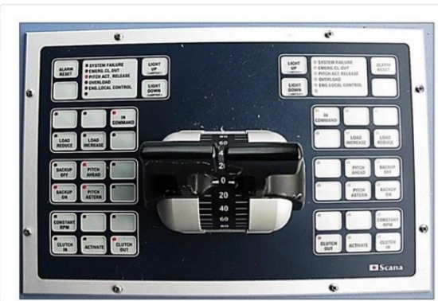
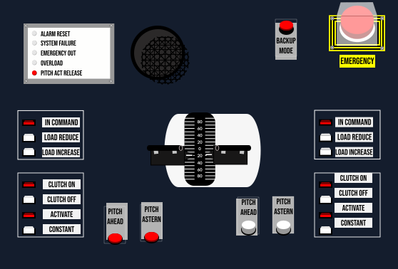

# TASK 1 : Menganalisis kecelakaan yang terjadi karena desain yang eror (di masa lampau)

## Kecelakaan kapal feri

1. Normalnya, semua manusia memiliki kebutuhannya masing-masing untuk menghidupi kehidupannya. Mulai dari yang teraba (konkret), seperti makanan, rumah, & kendaraan, hingga yang tak teraba, seperti pendidikan, psikologi, dan spiritual. Seiring berkembangnya zaman, kebutuhan manusia pun terus berubah-ubah. Terlebih, dengan kemajuan IPTEKS, kebanyakan produk / barang yang dibutuhkan manusia pun umumnya lebih canggih dan inovatif dari yang terdahulu.

2. Di balik terciptanya suatu produk hingga dapat digunakan oleh konsumen, ada suatu hal yang cukup mendasar. Hal yang dapat meningkatkan efisiensi, produktivitas, kenyamanan, kelebihan, dan keterbatasan suatu produk. Hal tersebut ialah desain. Desain adalah suatu rancangan yang dibuat untuk menunjukkan gambaran dan fungsi atau cara kerja suatu objek sebelum objek tersebut diproduksi.

3. Desain memiliki banyak macam. Mulai dari desain grafis, desain arsitektur, desain seni dan ilustrasi, hingga desain UI/UX. Umumnya, desain UI/UX inilah yang sangat berpengaruh terhadap kualitas suatu produk nantinya. Desain ini sangat penting dan berpengaruh karena dalam desain inilah pengalaman dari user dan produk kita diperkirakan nasibnya.

4. Kemudian, apakah desain UI/UX selalu berakhir dengan kepuasan dari user? Seharusnya iya, tapi tak sedikit desain tersebut berakhir kerugian di tangan user. Mulai dari kerugian yang kecil hingga kerugian yang berakhir fatal.

5. Salah satu UI/UX design error yang berakhir fatal, yaitu kecelakaan kapal feri di Kota New York pada tahun 2013. Kecelakaan ini cukup fatal sehingga melukai lebih dari 80 penumpang kapal. Kecelakaan ini terjadi pada 9 Januari 2013 lalu. Kecelakaan ini terjadi di Hudson River. Pada saat itu, kapal feri besutan Seastreak tersebut sedang dalam perjalanan dari Atlantic Highlands, New Jersey dan akan berlabuh di dermaga Lower Manhattan dengan membawa 326 penumpang dan 5 awak kapal. Dilansir pada laman [Insurance Journal](https://www.insurancejournal.com/news/east/2014/04/10/325951.htm)
, sebelum mendekati dermaga, kapal tersebut hendak melewati jembatan Verrazano-Narrows. Kemudian, kapten kapal pun merasakan getaran dan mengira ada debris / bata yang tersangkut pada baling-baling kapal. Dengan sigap, kapten pun mengganti piloting system kapal menjadi backup mode dengan menekan tombol “backup mode on” pada konsol kontrol panel. Pada mode ini, baling-baling kapal akan condong ke atas yang mengakibatkan kapal untuk bergerak lebih cepat dari biasanya. Teknik inipun lazim digunakan pada waktu tertentu secara sementara. Namun, kapten lupa untuk mengganti mode kapal sehingga kapal masih dalam backup mode sepanjang perjalanan. Tak lama, kapal pun mulai mendekati dermaga.
Kemudian, dikutip dari buku Tragic Design karya Jonathan Shariat, Cynthia Savard Saucier, kapten mencoba untuk mentransfer kontrol kapal ke konsol kanan yang dekat dengan jendela. Hal ini dilakukan agar dia dapat mengendalikan kapal sekaligus dapat melihat dermaga dengan mudah dan mempersiapkan manuver untuk melabuh. Akan tetapi, dia pun baru sadar kalau kapal tak kunjung melambat. Dia berasumsi bahwa dia telah melakukan kesalahan saat mentransfer kontrol ke konsol kanan. Di detik-detik terakhir sebelum kapal menabrak dermaga, kapten hanya dapat berbolak-balik dari konsol satu ke konsol lainnya (ada 3 konsol) untuk mencari penyebab masalah ini. Sayangnya, karena desain konsol yang begitu rumit dengan keterangan tombol yang sangat kecil, ditambah adanya rasa panik, kapten pun tidak dapat menyelamatkan keadaan. 
Akhirnya, kapal pun menabrak dermaga dengan kecepatan 14 knots atau sekitar 26 km/jam. Hal ini pun menyebabkan penumpang yang sedang berdiri terlempar hingga ada yang jatuh dari tangga. Selain itu, hal ini juga mengakibatkan kerusakan yang cukup besar pada bagian depan kapal.
Dilaporkan pada laman [NBC New York](https://www.nbcnewyork.com/news/local/ferry-crash-south-street-pier-11/1970100/), setidaknya ada 80 penumpang yang terluka, yang terdiri dari 9 luka luka serius, 2 kritis, dan sisanya luka ringan. Dilaporkan pula dari laman [New York Times](https://www.nytimes.com/2013/01/10/nyregion/ferry-accident-in-lower-manhattan-leaves-many-injured.html), bahwa 1 dari 2 orang yang kritis mengalami trauma parah pada bagian kepala karena terjatuh dari tangga.
Kecelakaan ini murni disebabkan oleh human error dan design error. Walaupun kapten kapal sudah sangat berpengalaman dan lulus tes narkoba dan alkohol, semua ini tak dapat dihindari dengan adanya 3 konsol panel kontrol dengan tombol-tombol yang kecil dan rumit. 

   

    _Sumber gambar: Jonathan Shariat, Cynthia Savard Saucier, Tragic Design: The Impact of Bad Product Design and How to Fix It_

* Dengan tombol-tombol yang banyak, keterangan tombol yang sulit terbaca, indikator lampu yang sangat kecil, dan penempatan tombol yang tidak begitu teratur, hal ini sangat berbahaya bagi kapten untuk mengontrol kapal, terlebih pada keadaan darurat.
	
### Kecelakaan seperti ini bisa saja dihindari jika prinsip-prinsip HCI (Human-Computer Interaction) sudah diterapkan secara benar dan optimal. Pencegahan yang dapat dilakukan sesuai dengan prinsip HCI, yaitu:

1. Membuat Tampilan Tombol dengan Lebih Jelas
     
     Hal ini dapat dilakukan dengan cara menuliskan keterangan / label tombol secara jelas agar mudah terbaca. Selain itu, bisa juga dengan menghilangkan tombol-tombol kosong tidak berlabel dari konsol sehingga konsol pun terlihat lebih lapang dan label tombol pun juga bisa diperjelas lebih besar lagi. Dengan mengikuti langkah ini, kita sudah memenuhi prinsip HCI yaitu visibility.

2. Mengoptimalkan Fungsi dari Indikator Tombol

    Hal ini dapat dilakukan dengan meng-upgrade indikator tombol yang sudah ada. Contoh, indikator yang sudah adalah lampu yang awalnya hanya lampu kecil diubah menjadi lampu yang seukuran tombol. Jadi, saat tombol ditekan, tombol pun akan ikut menyala dengan warna …. . Kemudian, untuk tombol-tombol yang digunakan secara sementara seperti tombol backup mode, bisa diberi indikator lampu kedap-kedip. Selain itu, bisa juga dengan menambahkan indikator lain, seperti suara lewat speaker. Contohnya, ketika tombol ditekan, akan ada indikator suara dan untuk tombol backup mode, bisa juga ditambahkan indikator pengingat akan status keaktifan tombol tersebut (misal: indikator suara ”backup mode, on” di tiap 1 menit sekali). Dengan mengikuti langkah ini, kita sudah memenuhi prinsip HCI yaitu feedback (adanya respon berupa lampu atau suara saat tombol tombol ditekan), serta consistency (memberikan indikator pengingat tombol backup mode secara konsisten sehingga tidak lupa untuk dimatikan kembali).

3. Menambahkan Tombol Darurat
    
    Dengan menambahkan tombol darurat pada bagian konsol panel yang masih kosong. Fungsi tombol ini adalah untuk mereset semua mode pada kapal menjadi normal, memperlambat laju kapal, serta menghidupkan alarm sagar upaya penumpang bersiap untuk mengambil posisi teraman. Tombol ini pun harus diberi pelindung kaca sehingga terhindar dari salah tekan dan mudah ditekan pada saat yang dibutuhkan. Dengan adanya tombol ini, maka prinsip pembatasan atau constraint pun terpenuhi.
    
### Setelah menganalisis pemicu kecelakaan dan mempertimbangkan prinsip-prinip imk, kami pun membuat desain mockup dari panel konsol kapal feri tersebut:
   
