# TASK 2 : Applying Design Sprint
-----

## Phase 1
* Sabtu, 3 Oktober 2020
* Diskusi tentang mengapa aplikasi memiliki masalah.
* Link rekaman: [**Meeting 1 Team H - Diskusi tentang Aplikasi yang akan Dievaluasi**](https://www.youtube.com/watch?v=btmB-ScKcv0)
* Subtitle: <a href="https://github.com/teamh-ilkom19unj/HCI/blob/hw2/TASK-2/Subtitles/Script%20Video%201%20-%20Diskusi%20tentang%20Aplikasi%20.srt">Klik disini</a>

## Phase 2
* Minggu, 4 Oktober 2020
* Membuat desain solusi yang bersaing dengan menerapkan Design Material Principles, yaitu:
 1. Expressive
 2. Diverse
 3. Reality Based

* [**Desain yang terpilih.**](https://github.com/teamh-ilkom19unj/HCI/blob/hw2/TASK-2/README.md#desain-1-desain-yang-terpilih)
* [**Desain 2.**](https://github.com/teamh-ilkom19unj/HCI/blob/hw2/TASK-2/README.md#desain-2)

## Phase 3
* Kamis, 8 Oktober 2020
* Menentukan deasin solusi akhir dengan voting. Para voters kami adalah yang pertama, Vina Amanda seorang ibu berumur 27 tahun yang sudah memiliki satu(1) anak yang sedang merencanakan kehamilan kedua, akan sangat tepat jika kami menjadikan Vina Amanda sebagai voters di aplikasi Kesehatan Reproduksi Calon Pengantin. Vina Amanda mengundang adik iparnya yang bernama Sintya Putri yang seorang mahasiswi jurusan akuntansi berumur 19 tahun dan voters kami yang terakhir adalah Sinta Pebriyanti dimana sudah menjadi mahasiswi kedokteran berumur 20 tahun. Kami mengumpulkan para voters dengan cara membuat pengumuman di akun instagram pribadi kami.
* Link rekaman: [**Meeting 2 Team H - Voting Design Solution Aplikasi**](https://www.youtube.com/watch?v=nfJ_GDCbELM&t=113s)
* Subtitle: <a href="https://github.com/teamh-ilkom19unj/HCI/blob/hw2/TASK-2/Subtitles/Script%20Video%202%20-%20Voting%20Design%20Solution.srt">Klik disini</a>

## Phase 4
* Minggu, 11 Oktober 2020
* Menguji & meminta feedback pada costumer. Costumer di sini merupakan app developer dari aplikasi yang kami evaluasi
* Link rekaman: [**Meeting 3 Team H - Dialog dan Feedback dari App Developer**](https://www.youtube.com/watch?v=rG2fqIo_UoI&t=31s)
* Subtitle: <a href="https://github.com/teamh-ilkom19unj/HCI/blob/hw2/TASK-2/Subtitles/Script%20Video%203%20-%20Dialog%20Dan%20Feedback%20App%20Developer.srt">Klik disini</a>

<h2>Design Improvement</h2>

 

## ***Desain Original*** 
Desain original atau desain asli aplikasi Kescatin dapat dilihat pada link ini: https://github.com/teamh-ilkom19unj/HCI/tree/hw2/TASK-2/Design_Solution/design_lama  
**Design Original** | **Desain Original**
------------------- | ---------------------------------
a|b
c|d
e|f

## ***Desain 1 (Desain yang terpilih)***

**Hasil Re-Design** | **Hasil Re-Design**
------------------- | ---------------------------------
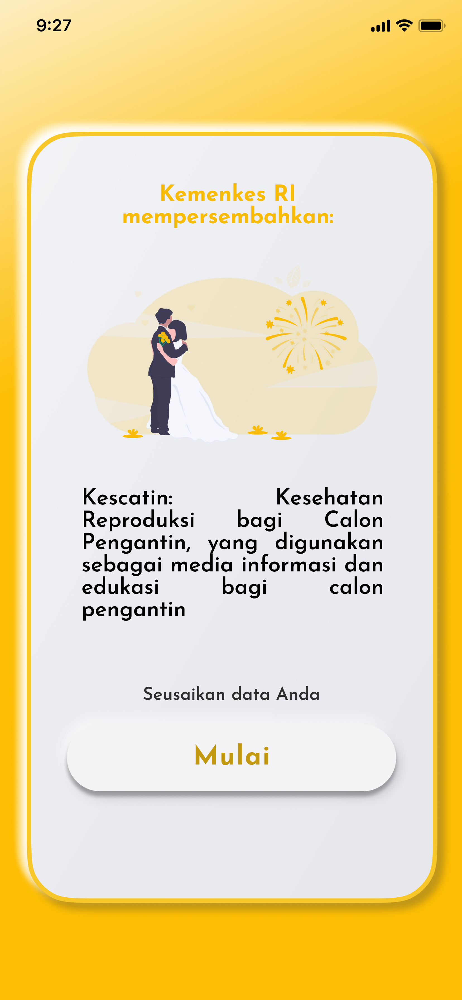|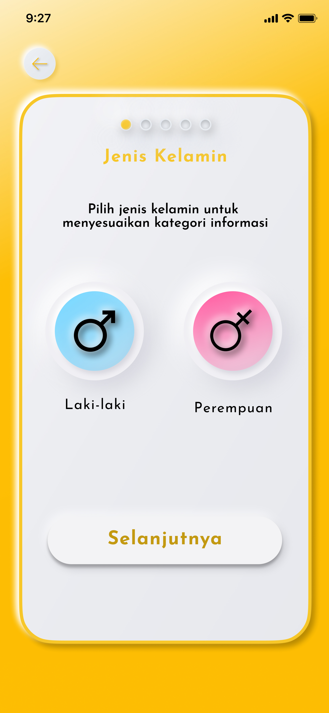
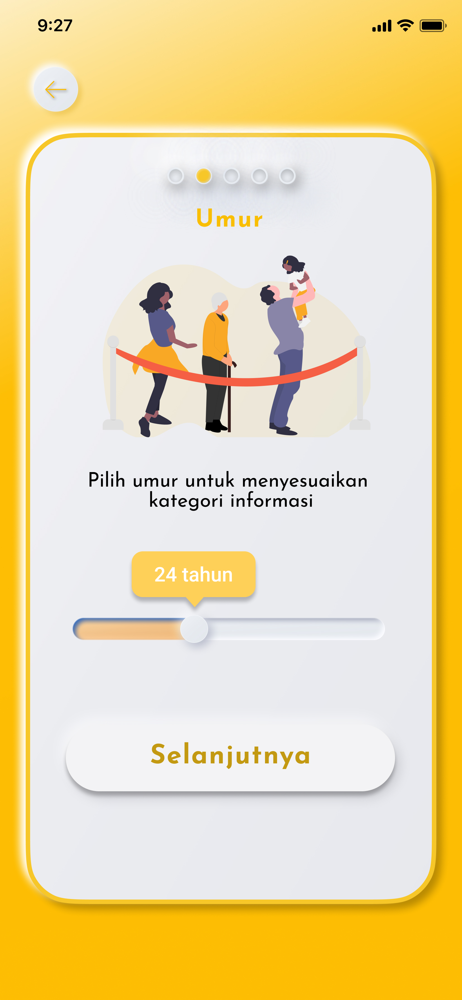|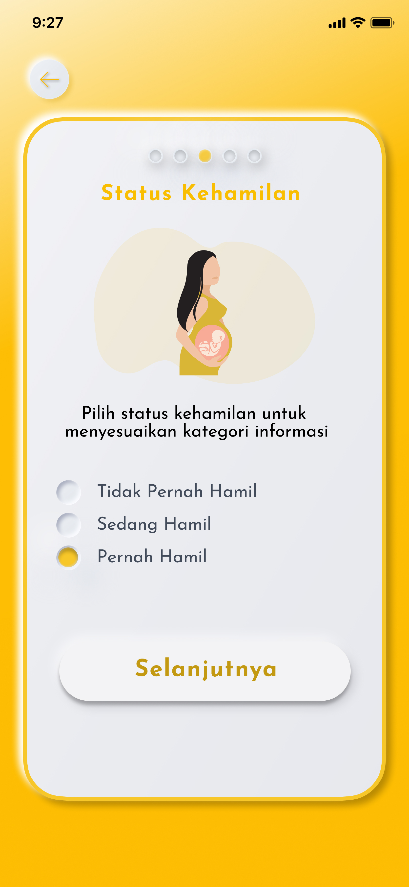
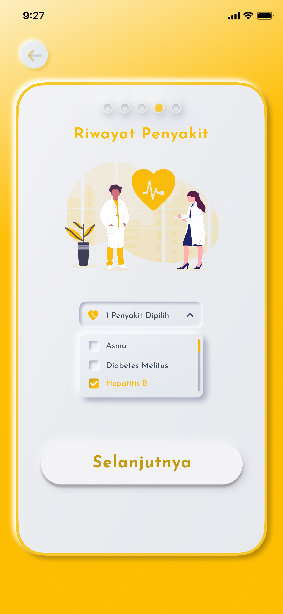|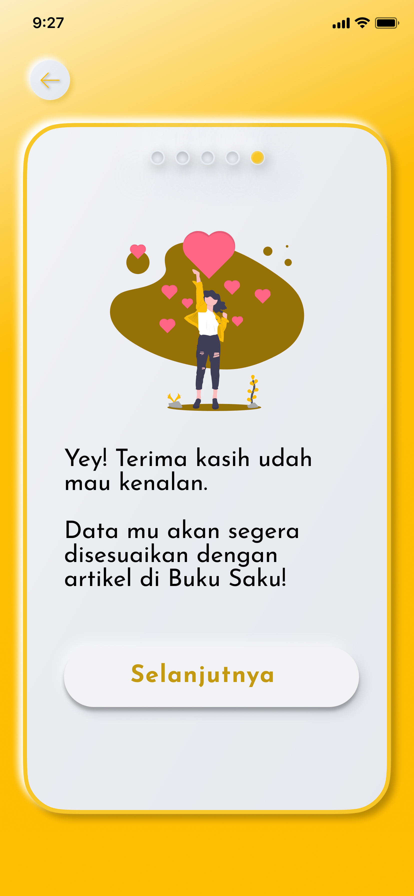
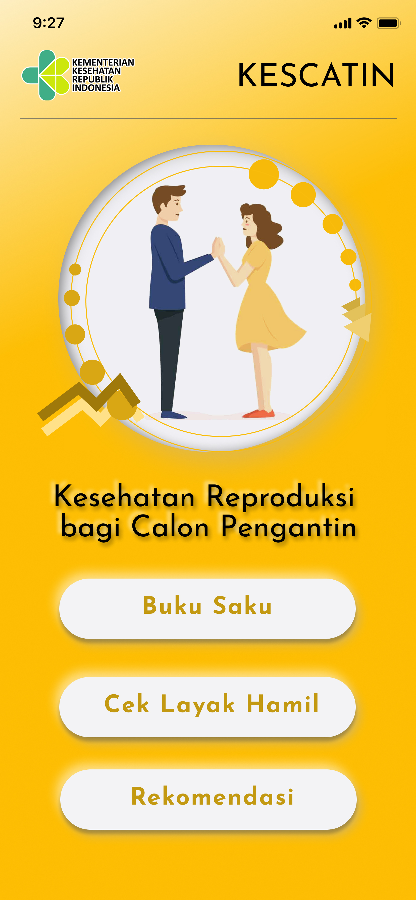|
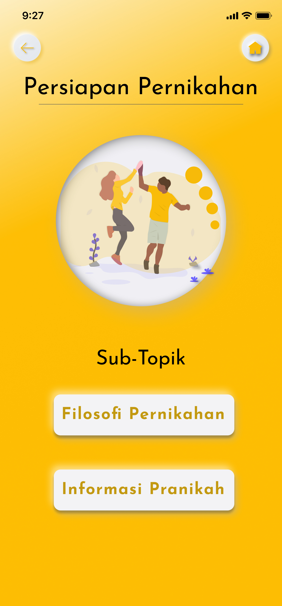|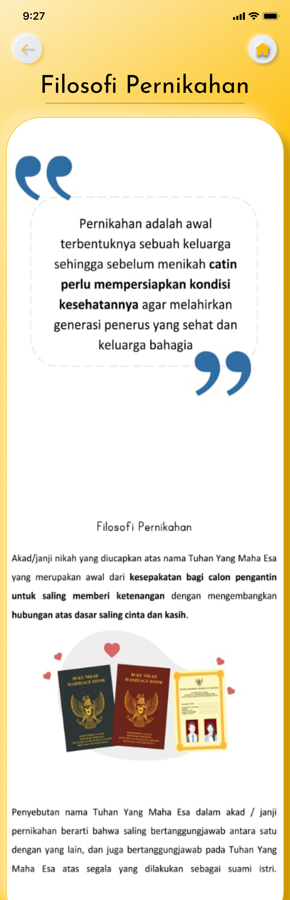
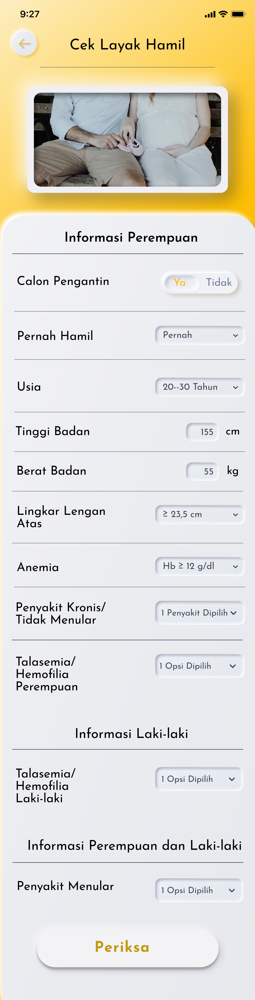|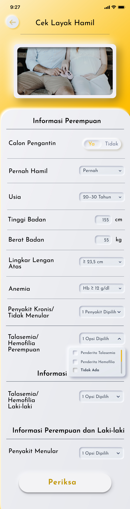
|
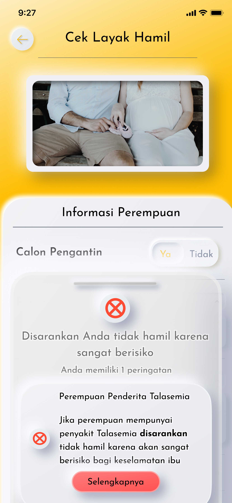|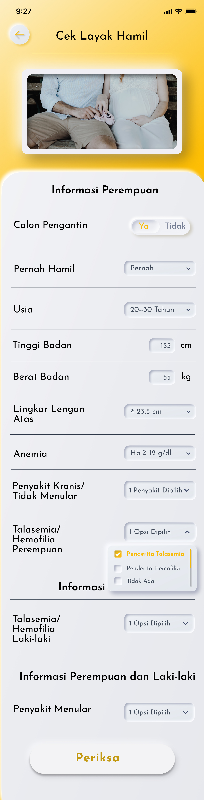
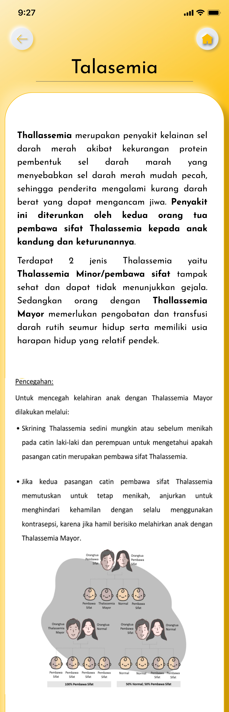|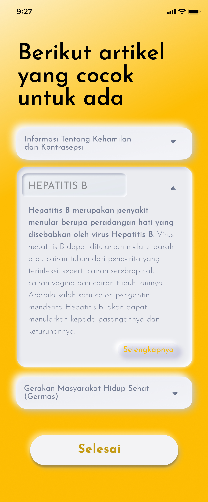

----
## ***Desain 2***

**Hasil Re-Design** | **Hasil Re-Design**
------------------- | ---------------------------------
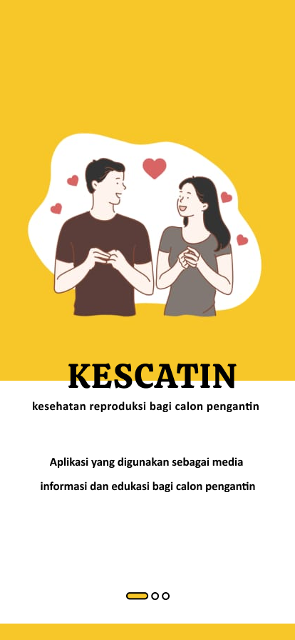|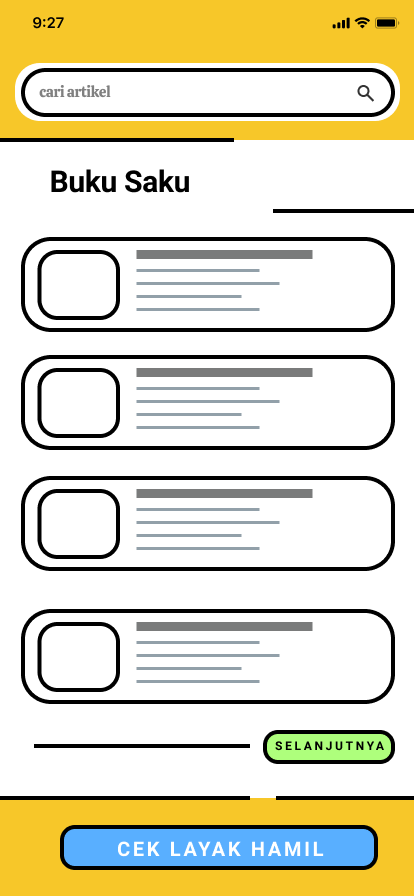
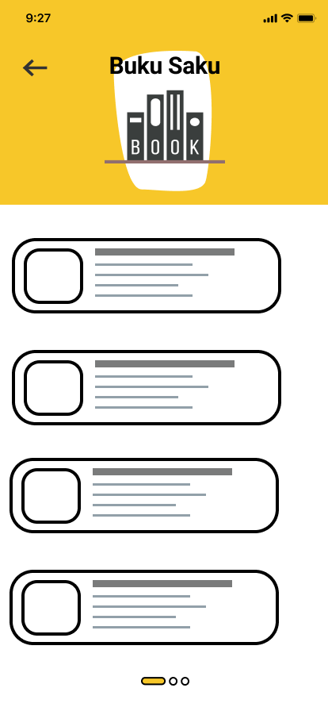|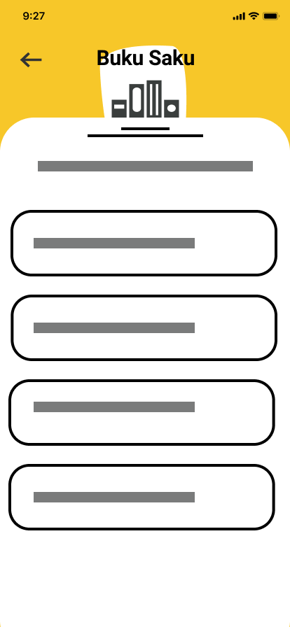
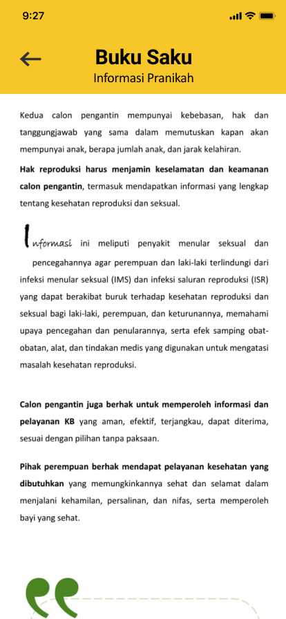|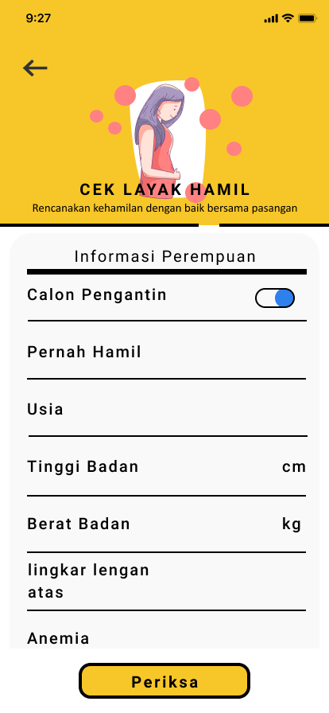
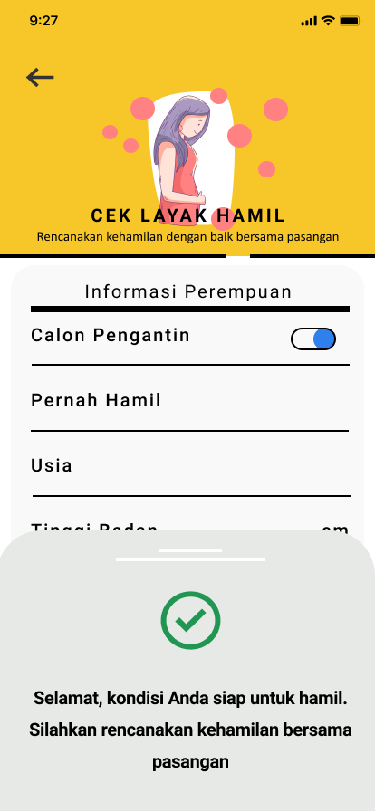|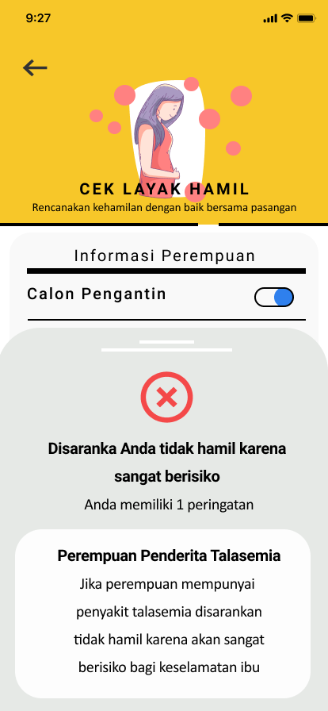

 

