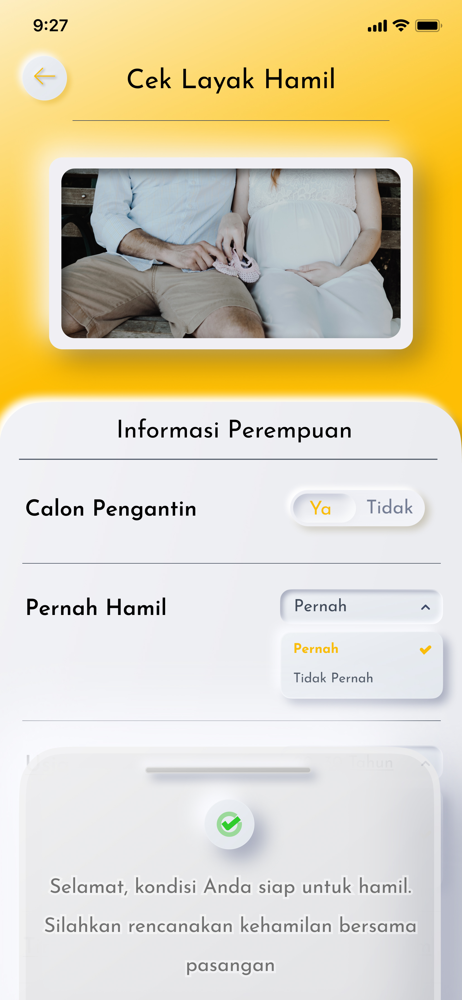

# TASK 2 : Applying Design Sprint
-----

## Phase 1
* Sabtu, 3 Oktober 2020
* Diskusi tentang mengapa aplikasi memiliki masalah.
* Link rekaman: [Meeting 1 Team H - Diskusi tentang Aplikasi yang akan Dievaluasi](https://www.youtube.com/watch?v=btmB-ScKcv0)

## Phase 2
* Minggu, 4 Oktober 2020
* jelasin material design

## Phase 3
* Kamis, 8 Oktober 2020
* Menentukan desasin solusi akhir dengan voting. Para voters adalah .... yang kami kumpulkan dengan cara.....
* Link rekaman: [Meeting 2 Team H - Voting Design Solution Aplikasi](https://www.youtube.com/watch?v=nfJ_GDCbELM&t=113s)

## Phase 4
* Minggu, 11 Oktober 2020
* Menguji & meminta feedback pada costumer. Costumer di sini merupakan app developer dari aplikasi yang kami evaluasi
* Link rekaman: [Meeting 3 Team H - Dialog dan Feedback dari App Developer](https://www.youtube.com/watch?v=rG2fqIo_UoI&t=31s)

<h2>Design Improvement</h2>

 

***Improvement 1***

**Hasil Re-Design** | **Hasil Re-Design**
------------------- | ---------------------------------
|
|
|
|
|
|
|
|
|

----

**Hasil Re-Design** | **Hasil Re-Design**
------------------- | ---------------------------------
|
|
|
|

Di improvement kedua, kami memperbaiki logo perusahaan (KOMET), notification button dan profile button yang terletak di pojok kanan atas. Menurut kami, lebih baik logo perusahaan tersebut diletakkan di sebelah kiri notification button dan profile button. Lalu, notification button dan profile button-nya diperbesar. 

